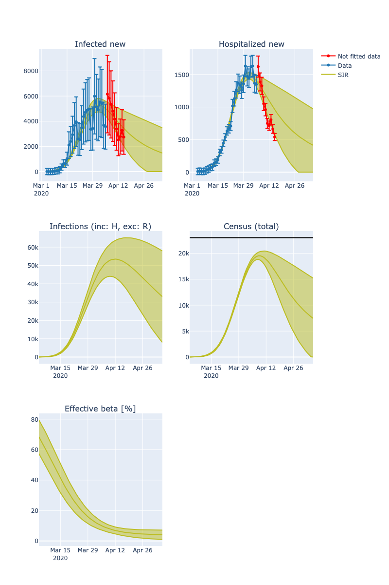

# COVID-19 Analysis of NYC Data

This repository provides tools which allow to characterize uncertainties in estimations of COVID-19 hospital admissions based on the [CHIME model](https://github.com/CodeForPhilly/chime).


## Details

This repository implements tools which utilize the [SIR model](https://en.wikipedia.org/wiki/Compartmental_models_in_epidemiology#The_SIR_model) and variations which add effects of social distancing measures and delay in hospitalizations (SIHR model).
Simulations of these models are fitted to data in a statistical context which allows to extract model parameter distributions for, e.g., social distancing policies and initial infections.
Predictions of fitted models are compared to data provided by the [NYC Department of Health and Mental Hygiene (DOHMH)](https://github.com/nychealth/coronavirus-data) to predict a 1-2 week window.

For more details see [`doc/details`](doc/details.md).

## Disclaimer

I do not have a background in epidemiology or related fields.
For now, the analysis was **not cross-checked and reviewed by an expert in the field**.
While I am confident that predictions are stable in a time-frame of 1-2 weeks from a data-driven point of view, I might have missed important details specific to this problem.
If you are familiar with this field, please reach out and provide feedback.



## Conclusion

1. Fitting daily new admissions of the NYC data makes it possible to consistently predict admissions in a 1-2 week window.
If social measures do not change, the prediction window might be extended.
2. Including social distancing measures is essential to describe the data. To reliably fit social distancing model parameters, one has to "see a bend" in admissions.
3. The NYC data suggests no significant delay in hospitalizations once a test is positive.
4. The data possibly suggests that hospitalized persons are still infecting others.


## Install

Install dependencies using, for example, `pip` by running
```bash
pip install [--user] -r requirements.txt
```
To run the comparisons against Penn CHIME, you also have to install the `penn_chime` module from [github.com/CodeForPhilly/chime](https://github.com/CodeForPhilly/chime).

Scripts are supposed to be run from the repo root directory.


## Usage

### Prepare data as a set of Gaussian random variables
```python
import numpy as np
from gvar import gvar

# Specify infected new data and associated error
hospitalized_new, standard_deviation_hospitalized_new = np.array(...), np.array(...)
YY = gvar(hospitalized_new, standard_deviation_hospitalized_new).T
```

### Prepare model and data meta parameters for fit
These parameters are fixed during the fit
```python
XX = {
    "date": date_range,
    "initial_susceptible": 8.6e6,
    "initial_hospitalized": 100,
    "initial_recovered": 0,
    "capacity": 23000,  # Capacity of hospitals
    "length_of_stay": 14  # Length of stay in hospital (days)
}
```

### Prepare fit parameters
These parameters will be updated during the fit
```python
prior = {
    # Days after which infections double (at the beginning of the simulation)
    "inital_doubling_time": gvar(3, 2),
    # Days until infected person is recovered
    "recovery_days_i": gvar(14, 3),
    # Inital infections, wild guess since uncertain number
    "initial_infected": gvar(1.0e4, 2.0e4),
    # Maximal reduction of social distancing for (logistic function R)
    "ratio": gvar(0.7, 0.2),
    # How many days to go from ~ R/4 to R/2 (logistic function Delta t)
    "social_distance_halfing_days": gvar(5, 4),
    # After how many days distancing measures is 0.5 ratio (logistic function t0)
    "social_distance_delay": gvar(5, 4),
    # The rate how of how many newly infected person become hospitalized
    "hospitalization_rate": gvar(0.2, 0.1)
}
```

### Run the fit

```python
from lsqfit import nonlinear_fit
from models import sir_step, one_minus_logistic_fcn, FitFcn

fcn = FitFcn(sir_step,     
    columns=["hospitalized_new"], # which SIR data to fit
    beta_i_fcn=one_minus_logistic_fcn, # Function which implements social distancing
    as_array=True, # fcn(...) returns array
    drop_rows=[0], # fcn(...) drops first row (since "new" data not defined for day 0; shape of YY)
)
fit = nonlinear_fit(data=(XX, YY), fcn=fcn, prior=prior)
```

### Present fit

```python
from utils.plotting import plot_fits, summarize_fit
print(summarize_fit(fit_sir))
fig = plot_fits(fit, extend_days=31, plot_residuals=False, plot_infections=True)
fig.show()
```

### Further details

The `How-to-use-fitter.ipynb` notebook is a good start for learning more while the `NYC-predictions.ipynb` notebook compares both models.

## Repository content

### Computation

Folder | Description
---|---
`models` | Implementation of the SIR and SIHR model including wrappers which simplify fitting
`utils` | Utility functions for loading data and plotting fits
`tests` | Unit tests for implemented models
`docs` | Description of the models and analysis

### Analysis notebooks

File | Description | Conclusion
---|---|---
`SIR-penn-chime-benchmark` | Comparison of SIR model in this repository against `penn_chime` | Both modules agree with and without social distancing measures.
`SIHR-SIR-benchmark` | Comparison of SIR model and SIHR model for similar parameters | Models produce similar spread scenario but significantly differ in numbers of hospitalizations if fitted at the initial phase of disease spread
`NYC-data-preparation` | Model-independent analysis of NYC data | NYC data has seemingly no delay between identifying infections and hospitalizations; Looking at temporal variations, new admissions per day fluctuate around ~10-15%.
`NYC-social-distancing-fits-SIR` and `SIHR` | Fit analysis of SIR/SIHR model for NYC data | Data is best described if social distancing policies are fitted as well; to reliably extract social distancing fit parameters, a visible kink in new admissions per day should be visible; Fits after kink are consistent and allow meaningful extrapolations for 1-2 weeks.
`NYC-predictions` | Fit and prediction of `SIR` and `SIHR` to NYC data |  Models agree quantitatively within 1-2 standard deviations and allow consistent predictions. SIR describes the data slightly better suggesting no temporal delays in hospitalizations and that hospitalized persons may infect others.

## Tests

Models implemented in this repo are compared against `penn_chime` in the `SIR-penn-chime-benchmark.ipynb ` notebook.
More tests for both models are implemented in the `tests` directory.
After installing `requirements-dev.txt`, you can run them with
```bash
pytest
```

## Contribute

Feel free to reach out and file issues for questions.
